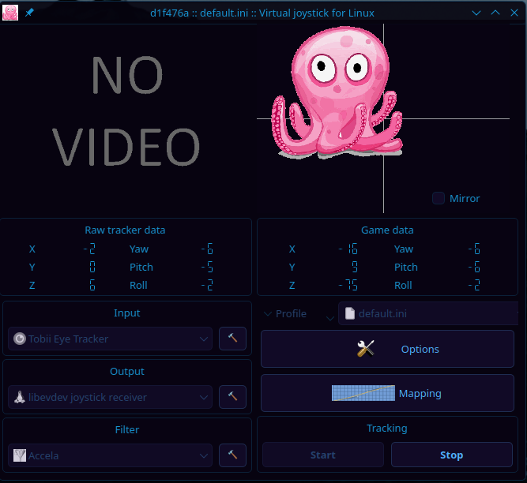

# How to Patch opentrack for Tobii Eye Tracker 5 on Linux

The upstream [opentrack](https://github.com/opentrack/opentrack) Tobii tracker plugin is **Windows-only**. This guide walks you through patching it to build and run on Linux, including fixing the broken SDK header that ships with the Tobii Stream Engine.

## Overview

Two things need to happen:

1. **Fix the SDK header** — The official `tobii.h` declares `tobii_device_create` with 3 arguments, but the v4 binary actually expects 4 (with a `field_of_use` parameter). Without this fix, the plugin will compile but **crash at runtime** due to stack corruption.
2. **Patch the CMakeLists.txt** — The upstream build file only enables the Tobii plugin on Windows. Our patch adds a Linux `elseif` branch.

## Prerequisites

```bash
# Arch Linux / Manjaro
sudo pacman -S opentrack cmake qt6-base gcc pkg-config

# Debian / Ubuntu
sudo apt install opentrack cmake qt6-base-dev g++ pkg-config

# The Tobii Stream Engine SDK must be installed:
#   libtobii_stream_engine.so  ->  /usr/lib/
#   tobii/tobii.h              ->  /usr/include/tobii/
```

You also need the opentrack source code matching your installed version:

```bash
# Example for opentrack 2026.1.0
cd /tmp
wget https://github.com/opentrack/opentrack/archive/refs/tags/opentrack-2026.1.0.tar.gz
tar xzf opentrack-2026.1.0.tar.gz
cd opentrack-opentrack-2026.1.0
```

## Step 1: Fix the Tobii SDK Header

The Tobii Stream Engine v4 SDK has a **critical ABI mismatch** in its header file. The shipped `tobii.h` declares:

```c
// WRONG — 3 arguments (what the header says)
tobii_device_create(tobii_api_t* api, char const* url, tobii_device_t** device);
```

But the actual binary (`libtobii_stream_engine.so`) expects:

```c
// CORRECT — 4 arguments (what the binary actually uses)
tobii_device_create(tobii_api_t* api, char const* url,
                    tobii_field_of_use_t field_of_use, tobii_device_t** device);
```

On x86-64 Linux, calling with 3 args means the library reads `%rcx` (the 4th argument register) as the output device pointer — but it contains garbage. Result: segfault or silent memory corruption.

### Option A: Use our pre-fixed header (recommended)

Copy our reconstructed header that already has the correct 4-arg signature:

```bash
sudo cp reference/tobii_header.h /usr/include/tobii/tobii.h
```

This is a complete 2600+ line header reconstructed from the SDK with the `field_of_use` enum and corrected function signature.

### Option B: Patch the existing header automatically

Run our fix script on the installed header:

```bash
# First copy the system header to a working location
cp /usr/include/tobii/tobii.h /tmp/tobii_header.h

# Run the patch script
python3 reference/fix_tobii_header.py

# Install the fixed header
sudo cp /tmp/tobii_header.h /usr/include/tobii/tobii.h
```

The script (`reference/fix_tobii_header.py`) does the following:

- Finds the old 3-arg `tobii_device_create` declaration
- Adds the `tobii_field_of_use_t` enum (`INTERACTIVE = 1`, `ANALYTICAL = 2`)
- Replaces the signature with the correct 4-arg version

### Option C: Manual edit

If you prefer to edit by hand, find this line in `/usr/include/tobii/tobii.h`:

```c
TOBII_API tobii_error_t TOBII_CALL tobii_device_create( tobii_api_t* api, char const* url, tobii_device_t** device );
```

Replace it with:

```c
/* v4 field_of_use enum */
typedef enum tobii_field_of_use_t
{
    TOBII_FIELD_OF_USE_INTERACTIVE = 1,
    TOBII_FIELD_OF_USE_ANALYTICAL = 2,
} tobii_field_of_use_t;

TOBII_API tobii_error_t TOBII_CALL tobii_device_create( tobii_api_t* api, char const* url, tobii_field_of_use_t field_of_use, tobii_device_t** device );
```

## Step 2: Apply the CMake Patch

From the opentrack source directory:

```bash
cd /tmp/opentrack-opentrack-2026.1.0

# Apply the patch (adjust path to where you cloned squig-head-track)
git apply /path/to/squig-head-track/patches/tobii-linux-opentrack.patch
```

If `git apply` doesn't work (e.g. not a git repo), use `patch`:

```bash
patch -p1 < /path/to/squig-head-track/patches/tobii-linux-opentrack.patch
```

### What the patch does

The original `tracker-tobii/CMakeLists.txt` only builds inside `if(WIN32)`. Our patch:

1. Moves `set(SDK_TOBII ...)` outside the platform check so it's always available
2. Keeps the full Windows build path intact
3. Adds an `elseif(UNIX AND NOT APPLE)` branch that:
   - Uses `find_library(TOBII_STREAM_ENGINE tobii_stream_engine)` to locate the `.so`
   - Uses `find_path(TOBII_INCLUDE_DIR tobii/tobii.h)` to locate headers
   - Calls `otr_module(tracker-tobii)` if both are found
   - Optionally installs the `.so` alongside opentrack
   - Prints `"Tobii Stream Engine not found - skipping tracker-tobii"` if not found

## Step 3: Build opentrack with the Tobii Plugin

```bash
cd /tmp/opentrack-opentrack-2026.1.0
mkdir build && cd build

cmake .. -DCMAKE_BUILD_TYPE=Release
make -j$(nproc)

# Verify the plugin was built
ls -la libexec/opentrack/opentrack-tracker-tobii.so
```

If CMake reports `"Tobii Stream Engine not found"`, verify your SDK installation:

```bash
# Check library
ls -la /usr/lib/libtobii_stream_engine.so

# Check header
ls -la /usr/include/tobii/tobii.h

# The header must have the 4-arg device_create (check with grep)
grep "field_of_use" /usr/include/tobii/tobii.h
```

## Alternative: Build the Plugin Standalone

If you don't want to rebuild all of opentrack, use our standalone build script:

```bash
chmod +x reference/build_tobii_plugin.sh
./reference/build_tobii_plugin.sh
```

This compiles `opentrack-tracker-tobii.so` directly with g++ and links against your system's `opentrack-api.so`. The output goes to `/tmp/opentrack-tracker-tobii.so`.

To install it:

```bash
sudo cp /tmp/opentrack-tracker-tobii.so /usr/libexec/opentrack/
```

## Step 4: Run opentrack

```bash
opentrack
```

In the tracker dropdown, select **"Tobii Eye Tracker"**. Once working, you should see live tracking data:



The plugin uses `gaze_origin` to derive head pose via simple `atan2` on the inter-eye vector. This gives:

- **Yaw**: Decent (+/-5-8 deg accuracy)
- **Roll**: Reasonable (+/-3 deg)
- **Pitch**: Poor (+/-15 deg) — this is a fundamental limitation of deriving pitch from two coplanar points
- **Translation**: Workable (+/-5mm)

For better accuracy, the squig-head-track project aims to replace this simple approach with a biomechanical head model + Extended Kalman Filter. See [TOBII_HEAD_TRACKING_OPTION_C.md](../docs/TOBII_HEAD_TRACKING_OPTION_C.md).

## Troubleshooting

### Plugin crashes on startup

The header fix (Step 1) was not applied. The 3-arg vs 4-arg `device_create` mismatch causes a segfault. Verify:

```bash
grep "field_of_use" /usr/include/tobii/tobii.h
# Should show: tobii_field_of_use_t field_of_use
```

### "No Tobii device found"

Make sure `tobiiusbserviced` is running and the udev rules are installed:

```bash
sudo cp reference/99-tobii.rules /etc/udev/rules.d/
sudo udevadm control --reload-rules
sudo udevadm trigger
```

### Plugin not appearing in opentrack

CMake didn't find the Stream Engine. Check `cmake` output for the `"Tobii Stream Engine not found"` message. Ensure both the library and headers are in standard paths (`/usr/lib/` and `/usr/include/`).

### "tobii_device_create failed: 3" (TOBII_ERROR_NOT_SUPPORTED)

The `field_of_use` value is wrong. It must be `1` (`TOBII_FIELD_OF_USE_INTERACTIVE`) for consumer trackers. If you see this after the header fix, the opentrack source may need its `tobii_device_create` call updated to pass the enum.

## Files Reference

| File                                  | Description                                                    |
| ------------------------------------- | -------------------------------------------------------------- |
| `patches/tobii-linux-opentrack.patch` | CMakeLists.txt diff for Linux build support                    |
| `reference/tobii_header.h`            | Complete reconstructed SDK header with correct 4-arg signature |
| `reference/fix_tobii_header.py`       | Script to patch an existing header in-place                    |
| `reference/build_tobii_plugin.sh`     | Standalone g++ build script (no CMake needed)                  |
| `reference/99-tobii.rules`            | udev rules for device permissions                              |
